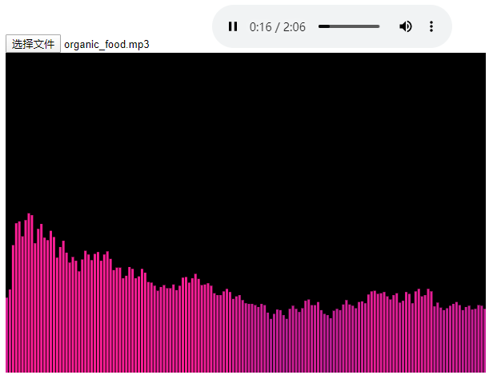

# 计算机图形学Project1 - 音乐节奏可视化

李东洋 -- 16307130226

### 一.  说明

基于web的音频的可视化，利用快速傅里叶变换将音频的时域转到频域，再利用canvas的画布可视化展示。

#####使用

利用浏览器打开```index.html``` ，再选择MP3文件，例如选择 ```assets/organic_food.mp3```，展示结果如下：



### 二. 程序说明

在 ```main.js``` 中有三个函数：

* ```start``` 的作用是选取音频文件，然后调用 ```playAudio``` 函数
* ```playAudio``` 包含向 ```html``` 加入 ```audio``` 标签进行播放，同时利用 fft 将音频转换到频域，最后调用 ```draw``` 函数画出柱状图
* ```draw``` 的作用将离散的频率画到 ```canvas``` 标签上

### 三. 算法原理

利用快速傅里叶变换将音频转到频域

### 四. 参考文献

[Fast_Fourier_transform][]

[Fast_Fourier_transform]: https://en.wikipedia.org/wiki/Fast_Fourier_transform

