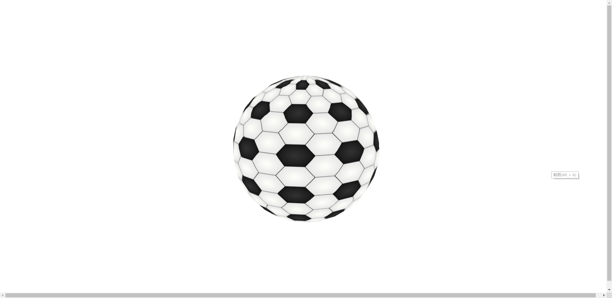

# 计算机图形学Project2 - 真实感静态景物

>  李东洋 -- 16307130226

### 一. 说明


利用 ```three.js``` ，制作 ```web``` 端的的一个 3d 的足球，因为读取本地文件有跨域问题，需要启用 http 服务才能正常访问，可以用任何工具启动一个 http 服务，例如以下利用 npm 安装 serve 构建一个 http 服务：

```shell
npm i serve -g
serve .
```


### 二. 结果



